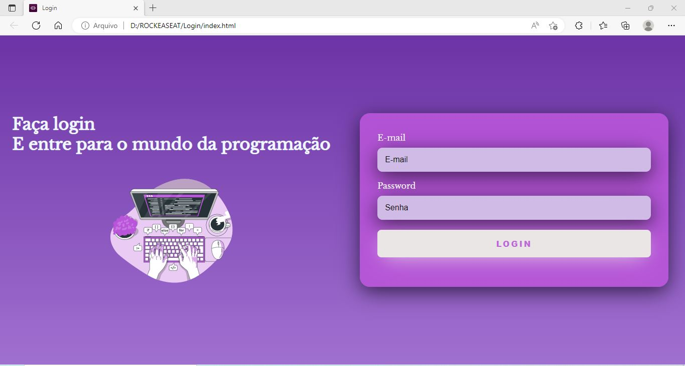

<h1 align="center">TELA DE LOGIN | HTML + CSS</h1>

  

# 🛠️ Tecnologias
<h4>Esse projeto pessoal foi desenvolvido com as seguintes tecnologias:</h4>
- HTML E CSS 
- Git e Github 
 

# 👨‍🎓 O que aprendi

- Para o desenvolvimento dessa página de login foi utilizado apenas HTML e CSS, além disso, foi usado uma imagem do site StorySet, um svg animado para dar um toque mais bonito para o site.

- Essa página de login será responsiva, ou seja, ela funciona em tablet, celular e computador.

- O google fonts foi utilizado para baixar a fonte Libre Baskerville para usar no projeto.

# 📧 Contato
 

